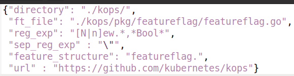
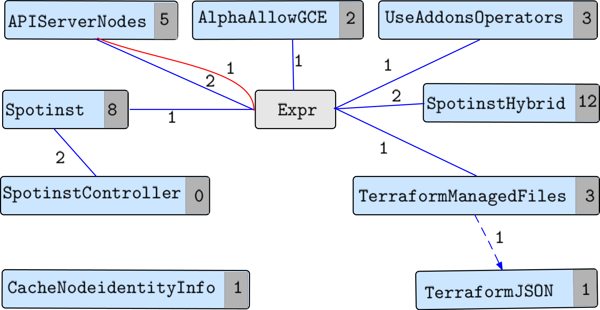

# POC : build a Feature Toggle Model

## Goal

Catch all the Feature Toggle (FT) dependencies of 6 real-world projects written in go.

## Detailed Results

See the Main notebook and the results directory to consult the results.

## In a nutshell

Based on a config file... 

... we download the project, statically analyse the code to mine the dependencies between FT, and extract a feature toggle model.

